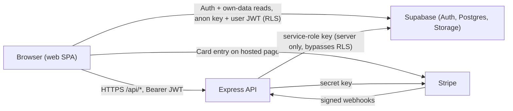
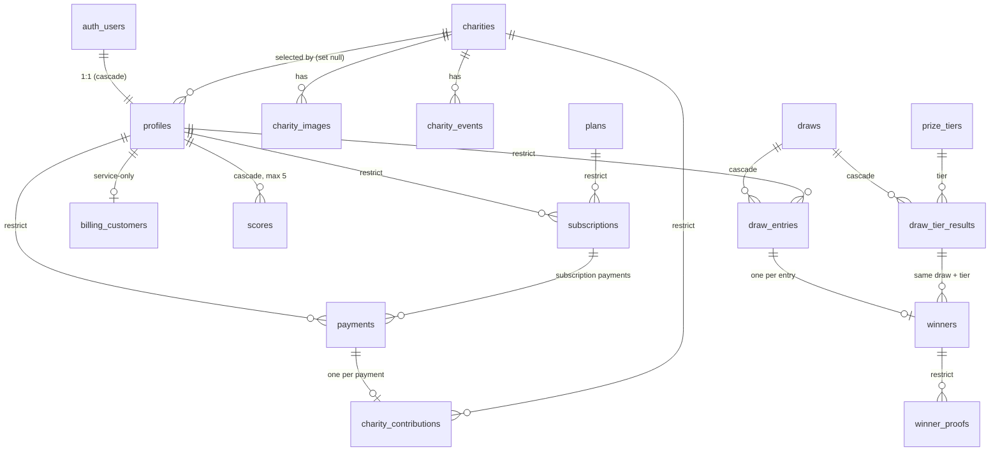
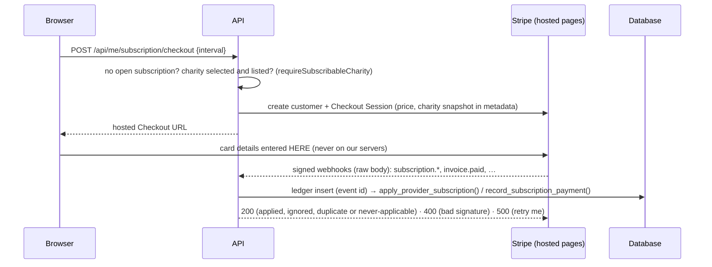

# Architecture

This document describes GATHER's architecture. Parts marked **Implemented** exist today (Phase 0 and
Phase 1). Parts marked **Planned** are direction, not code, and several depend on open decisions in
[DECISIONS.md](./DECISIONS.md).

Principle: a small, boring monorepo. No microservices, no Kubernetes, no queue infrastructure unless a
concrete requirement demands it.

## 1. Status

| Area                                                                          | Status                                                              |
| ----------------------------------------------------------------------------- | ------------------------------------------------------------------- |
| Monorepo, tooling, scripts                                                    | Implemented (Phase 0)                                               |
| Express app + `GET /api/health`, JSON errors, CORS                            | Implemented (Phase 0)                                               |
| React shell that calls `/api/health`                                          | Implemented (placeholder UI only)                                   |
| Shared contracts package                                                      | Implemented (health, errors, enums, constants)                      |
| **PostgreSQL schema, RLS, grants, storage policies**                          | **Implemented (Phase 1)**                                           |
| **Database tests (PGlite), development seed**                                 | **Implemented (Phase 1)**                                           |
| **Authentication and authorization (Supabase Auth, roles, guards)**           | **Implemented (Phase 2)**                                           |
| **Score engine (add / replace-oldest / edit / delete, atomic `add_score()`)** | **Implemented (Phase 3)**                                           |
| **Charity domain (directory, profiles, spotlight, choice + percentage)**      | **Implemented (Phase 4)**                                           |
| **Subscriptions and payments (Stripe test mode: Checkout, webhooks, Portal)** | **Implemented (Phase 5)**                                           |
| **Draw engine (random/algorithmic draw, pool, tiers, rollover, lifecycle)**   | **Implemented (Phase 6)**                                           |
| **Winner verification and payout tracking (proof, review, mark paid)**        | **Implemented (Phase 7)**                                           |
| User/admin dashboards, reports and analytics, full admin tooling              | **Planned** — nothing beyond a minimal winner/proof flow exists yet |
| Supabase project, Vercel project                                              | **Not provisioned** (must be new accounts)                          |

## 2. Repository layout

```text
gather/
  apps/
    web/             React + Vite + TypeScript SPA
    api/             Node.js + Express + TypeScript API
  packages/
    shared/          TypeScript contracts shared by web and api (compiled to dist/)
  supabase/
    migrations/      The schema: 15 ordered SQL files (source of truth for the database)
    tests/           Database tests (workspace @gather/db-tests): PGlite + Supabase shim
    seed.sql         Development-only data (local `supabase db reset` only)
  docs/              PRD notes, decisions, architecture, testing strategy
```

Dependency direction: `web → shared`, `api → shared`, `db-tests → shared`. `shared` depends on nothing in this
repo. `web` and `api` never import each other. Only the `api` may ever hold the Supabase service-role key.

## 3. System context



Reads that belong to the signed-in user may go browser → Supabase (RLS confines them to their own rows).
**Every other write** goes browser → API → Supabase using the service role (D-048).

## 4. Frontend (`apps/web`)

- **Implemented:** Vite + React 19 + TypeScript; dev proxy of `/api`; React Router with `/`, `/login`,
  `/signup`, protected `/account` and admin-only `/admin` (placeholder pages, not the final UI); an
  `AuthProvider` (Supabase session restoration, server-verified identity), route guards and a typed API
  client that sends the bearer token. All protected screens are UX only — the API enforces access.
- **Planned:** routing for the public site, subscriber area and admin area; a typed API client built on
  `@gather/shared`; the "Feel, not fairway" design system with subtle motion; responsive layouts.
- **Rules:** the bundle contains only public configuration (`VITE_*`). Route guards improve UX only; the API
  and the database are the enforcement points (Sections 9 and 12).

## 5. Backend (`apps/api`)

- **Implemented:** `createApp(config)` (testable without listening), `server.ts`, pure `config.ts`, JSON 404
  and a final error handler that never leaks internals. **Phase 2 adds** `src/auth/` (token verifier,
  profile repository, `requireAuth`/`requireAdmin`), `AppError` (client-safe status/code), `GET /api/me`
  and the guarded `/api/admin/*` router.
- **Planned layering** — dependencies point downward only:

  ```text
  routes (HTTP: authenticate, validate request, call a service, shape the response)
    └─ services (use-cases: orchestrate domain + repositories + Stripe + audit log)
         ├─ domain (PURE business rules: scores, draw, prize split, charity share)
         └─ repositories (the only code that talks to Supabase, using the service role)
  ```

- **Domain modules** are pure functions with the clock and random source passed in. They implement the
  rules the database deliberately does _not_ (score eviction, matching, pool and tier maths, rollover).
- **Scores (Phase 3)** — `apps/api/src/scores/`: `routes.ts` (validate with the shared pure validators, take the
  user id only from `req.auth`) → `service.ts` (subscription check on every write, outcome → HTTP error mapping) →
  `repository.ts` (the only Supabase code: `add_score` RPC, scoped queries). Endpoints: `GET/POST /api/scores`,
  `PUT/DELETE /api/scores/:playedOn` — a score is addressed by **date within the caller's own scores**, so no id
  or user id appears in any URL. Rules and error codes: DECISIONS D-061, D-062. Production wiring is a single
  composition root, `supabase-deps.ts`.
- **Charities (Phase 4)** — `apps/api/src/charities/`: `routes.ts` → `service.ts` → `repository.ts` (the only
  Supabase code), plus `text.ts` (search-text sanitising). **Public:** `GET /api/charities` (search, tag and
  featured filters, `limit`/`offset` with `hasMore`), `GET /api/charities/:slug`, `GET /api/charity-spotlight`.
  **Signed in, own data only:** `GET/PATCH /api/me/charity` (charity + percentage in basis points),
  `GET /api/me/contributions` (read-only history, per-currency totals). Public reads return **listed** charities
  only (the filter is explicit because the service role bypasses RLS); the search text becomes a tsquery built by
  the API from letter/digit runs only, so it cannot inject filter syntax; images are public URLs into the
  `charity-media` bucket. The percentage rules live once in `packages/shared/src/charities.ts`
  (`checkCharityPercentage`) and are enforced by the API and the database. Rules and codes: DECISIONS D-064, D-065.
  **CHR-01 (D-066):** the signup form collects the charity (pre-selected from a profile page's `?charity=`); it is
  sent as signup data and recorded by `handle_new_user()`. `CharityService.requireSubscribableCharity(userId)` is the
  precondition for subscribing — `422 charity_required` when none is selected, `422 selected_charity_unavailable`
  when the selected one was archived — and Stripe Checkout (Phase 5) calls it before creating anything at Stripe.
  No payment is executed and no contribution amount is computed here (Phase 5, D-025).
- **Billing (Phase 5)** — `apps/api/src/billing/`, all Stripe logic in one place: `gateway.ts` (the **only** file that
  imports the Stripe SDK; everything else depends on its `PaymentGateway` interface), `stripe-events.ts` (the trust
  boundary: parses every Stripe payload, current and older API shapes, from `unknown`), `status.ts` (Stripe status →
  local state), `service.ts` (plans, the user's subscription, Checkout and Portal — the charity precondition runs first),
  `webhooks.ts` (verified events → local state: idempotent and order-safe), `repository.ts` (the only Supabase code; writes
  go through two service-role-only SQL functions), `selection.ts` (the user's current charity for renewals), `routes.ts`.
  Endpoints: `GET /api/plans` (public), `GET /api/me/subscription`, `POST /api/me/subscription/checkout`,
  `POST /api/me/subscription/portal`, and `POST /api/webhooks/stripe` (raw body, before `express.json()`, authenticated
  by its signature). Rules and codes: DECISIONS D-067, D-068, D-069, D-070. `preflight.ts` is a read-only readiness check
  (`npm run preflight:stripe`) that compares `plans` with the Stripe prices. **No draw engine, no dashboards.**
- **Errors:** domain/service errors map to the shared `ApiErrorBody`; unexpected errors are logged and
  returned as a generic 500.

## 6. Database (Supabase / PostgreSQL) — Implemented

The schema lives only in `supabase/migrations/` (no dashboard edits). It targets a **new** Supabase project
and uses core PostgreSQL features only (no extensions), so it also runs on the PGlite test harness.

### 6.1 Conventions

- UUID primary keys (`gen_random_uuid()`); every timestamp is `timestamptz` (UTC).
- **Money:** domain `minor_units` (`bigint`, ≥ 0) in integer minor units, with a `currency_code` column beside
  it. **Percentages:** domain `basis_points` (`integer`, 0–10000; 10% = 1000). No `numeric`/float/`money`
  column exists. (D-046)
- **States are enums**, so unknown states are rejected by the database. Each enum is mirrored in
  `@gather/shared` and a test fails if they drift.
- **`updated_at`** is maintained by a trigger on mutable tables.
- **Deny by default:** default privileges for `anon`/`authenticated` are revoked; every table has RLS enabled
  and explicit grants (Section 9).

### 6.2 Migrations

| File                                          | Contents                                                                                                                                                                                                                                                                                                                                                     |
| --------------------------------------------- | ------------------------------------------------------------------------------------------------------------------------------------------------------------------------------------------------------------------------------------------------------------------------------------------------------------------------------------------------------------ |
| `…100000_types_and_helpers.sql`               | Hardening of default privileges, enums, `minor_units`/`basis_points`/`currency_code` domains, `set_updated_at()`                                                                                                                                                                                                                                             |
| `…100100_charities.sql`                       | `charities`, `charity_images`, `charity_events`                                                                                                                                                                                                                                                                                                              |
| `…100200_profiles_and_config.sql`             | `profiles`, `handle_new_user()`, `is_admin()`, `platform_settings`, `prize_tiers` (seeded)                                                                                                                                                                                                                                                                   |
| `…100300_billing.sql`                         | `plans`, `billing_customers`, `subscriptions`, `is_active_subscriber()`, `payments`, `charity_contributions`, `stripe_events`                                                                                                                                                                                                                                |
| `…100400_scores.sql`                          | `scores`, reject-only cap trigger                                                                                                                                                                                                                                                                                                                            |
| `…100500_draws_and_winners.sql`               | `draws`, `draw_entries`, `draw_tier_results`, `winners`, `winner_proofs`, immutability guards                                                                                                                                                                                                                                                                |
| `…100600_admin_audit_log.sql`                 | Append-only `admin_audit_log`                                                                                                                                                                                                                                                                                                                                |
| `…100700_rls_and_grants.sql`                  | Privileges and every RLS policy (the whole security model in one file)                                                                                                                                                                                                                                                                                       |
| `…100800_storage.sql`                         | Buckets and `storage.objects` policies                                                                                                                                                                                                                                                                                                                       |
| `…100900_score_cap_ignores_existing_date.sql` | Score cap no longer rejects statements that add no row (upsert-edit, `ON CONFLICT DO NOTHING`, duplicate date)                                                                                                                                                                                                                                               |
| `…101000_restrict_subscriber_lookup.sql`      | `current_user_is_active_subscriber()` for RLS/browser roles; `is_active_subscriber(uuid)` restricted to the service role                                                                                                                                                                                                                                     |
| `…110000_add_score_function.sql`              | `add_score()`: atomic add that replaces the oldest score (service role only)                                                                                                                                                                                                                                                                                 |
| `…120000_charity_selection_guard.sql`         | Trigger: an archived charity cannot be newly selected (`GS002`), on the API and the direct browser path                                                                                                                                                                                                                                                      |
| `…130000_signup_charity_selection.sql`        | `handle_new_user()` records the charity chosen on the signup form (one validated signup-data key; role/percentage untouched)                                                                                                                                                                                                                                 |
| `…140000_billing_foundation.sql`              | Webhook-safe `apply_provider_subscription()` and `record_subscription_payment()`; **access** `is_active_subscriber()` (strict: no tolerance, no grace, no Stripe fallback — owner D-070) beside **eligibility** `has_open_subscription()`; append-only `charity_contributions` and frozen `payments`; `payments.period_*`; `subscriptions.provider_event_at` |

Apply to a **new** Supabase project with the Supabase CLI (`supabase link --project-ref <new-ref>` then
`supabase db push`). Do not point it at any existing or personal project. `supabase/seed.sql` is _not_ a
migration and is never pushed.

### 6.3 Tables and their purpose

| Table                   | Purpose                                                                                                             |
| ----------------------- | ------------------------------------------------------------------------------------------------------------------- |
| `profiles`              | One row per account (1:1 with `auth.users`): `role` (`user`/`admin`), display name, selected charity, `charity_bps` |
| `platform_settings`     | Single row of values the PRD leaves open (pool portion, draw number range, charity cap); NULL until decided         |
| `prize_tiers`           | Current PRD rule: 5/4/3 matches → 40/35/25% and rollover flags                                                      |
| `charities`             | Charity directory: slug, name, description, tags, `is_featured`, `archived_at`, generated search vector             |
| `charity_images`        | Image objects (in `charity-media`) per charity, ordered                                                             |
| `charity_events`        | Upcoming events (e.g. golf days) per charity                                                                        |
| `plans`                 | The monthly and yearly plans (none seeded — prices undecided)                                                       |
| `billing_customers`     | User ↔ Stripe customer (service-only)                                                                               |
| `subscriptions`         | A user's subscription: status, raw provider status, period, cancellation stamps                                     |
| `payments`              | Money received via Stripe: subscription charges and donations                                                       |
| `charity_contributions` | The charity's share of each payment, with the basis and percentage used                                             |
| `stripe_events`         | Webhook idempotency ledger keyed by Stripe event id (service-only)                                                  |
| `scores`                | Stableford scores (1–45), one per user per date, at most 5 per user                                                 |
| `draws`                 | One draw per month: mode, status, winning numbers, pool inputs and snapshot, publish stamps                         |
| `draw_entries`          | A user's participation in a draw: snapshot numbers and match count                                                  |
| `draw_tier_results`     | Per draw and tier: pool, rollover in/out, winners, per-winner prize, remainder (frozen at publish)                  |
| `winners`               | A prize won: tier, amount, verification status, payout status                                                       |
| `winner_proofs`         | Metadata for the proof screenshot (the file is in the private bucket)                                               |
| `admin_audit_log`       | Append-only record of admin actions (written by the API)                                                            |

### 6.4 Relationships



Composite foreign keys keep related rows consistent without triggers:

- `charity_contributions → payments (id, user_id, currency, kind)`: a contribution must belong to the same
  user, currency and kind as its payment.
- `winners → draw_entries (id, draw_id, user_id, match_count)`, `→ draw_tier_results (draw_id, match_count)`
  and `→ draws (id, currency)`: a winner agrees with its entry, its tier result and the draw's currency.

### 6.5 Important constraints (all covered by tests)

- **Scores:** 1–45; date required; unique `(user_id, played_on)`; a trigger _refuses_ a 6th row per user (never deletes; serialised by an advisory lock). An `INSERT` for a date the user already has adds no row, so it is left to the unique constraint / `ON CONFLICT` (edit-by-upsert and idempotent retries work at the cap). Eviction is domain logic (D-049).
- **Charity:** `charity_bps ≥ 1000` on profiles and on subscription contributions; contribution ≤ basis;
  donations carry no percentage.
- **Plans/subscriptions:** one active plan per interval; one `pending`/`active` subscription per user; an
  `active` subscription has a renewal date.
- **Draws:** first-of-month date, unique; exactly 5 non-null numbers (derived, D-040; range/repeats free);
  `simulated`/`published` require numbers; `published` requires pool, subscriber count, currency and stamp.
- **Tier results:** rollover amounts only on rolling tiers; equal shares + remainder + rollover ≤ pool.
- **Winners:** one per user per draw; paid ⇒ `paid_at`; approved/rejected ⇒ `reviewed_at`; proof path must
  start with the winner id.
- **Immutability:** published draws, their entries and tier results cannot change; a winner's draw, user,
  tier and prize are frozen; a paid winner never returns to pending; winners are never deleted; the audit
  log is append-only. These guards apply even to the service role.

### 6.6 Indexing (from real access patterns)

`scores` (unique index doubles as the "latest scores" scan); `subscriptions (user_id, created_at desc)` and
`(status, current_period_end)`; a partial unique index for the live subscription; `payments (user_id,
created_at desc)` and a partial index on succeeded payments for revenue/pool queries; `charity_contributions
(charity_id)` for totals; `draw_entries (user_id, draw_id)` for "draws entered" and a partial index on
prize-tier matches; `winners (user_id, …)` and `(verification_status, payout_status)` for admin queues; GIN
indexes for charity full-text search and tags; a partial index for the homepage spotlight; a partial index
of unfinished Stripe events; audit log by time/entity/actor.

## 7. Shared contracts (`packages/shared`)

- **Implemented:** `HealthResponse`, `API_HEALTH_PATH`, `ApiErrorBody`; the PRD-stated constants
  (`SCORE_MIN/MAX`, `MAX_RETAINED_SCORES`, `MIN_CHARITY_BPS`, `PRIZE_TIERS`, …); the enum vocabularies
  (`DB_ENUMS`, `APP_ROLES`, …) and `STORAGE_BUCKETS`.
- **Not hand-written:** table row types. They would duplicate the schema. Once the Supabase CLI is available,
  generate them (`supabase gen types typescript --local > …`) into the API/web packages that need them, and
  keep `@gather/shared` for genuinely shared vocabulary. A test (`schema.test.ts`) fails if the mirrored
  enums or constants diverge from the migrations.
- **Rules:** no runtime dependencies on Express, React or Supabase; no secrets; compiled to `dist/` (D-007).

## 8. Authentication boundary — Implemented (Phase 2; method provisional, D-028/D-056)

```mermaid
sequenceDiagram
  participant B as Browser (supabase-js)
  participant SA as Supabase Auth
  participant API as Express API
  participant DB as Postgres (profiles)
  B->>SA: signUp / signInWithPassword (email + password, anon key)
  SA-->>B: session (access token + refresh token), persisted by supabase-js
  B->>API: GET /api/me — Authorization: Bearer <access token>
  API->>SA: (cached) fetch public keys — /auth/v1/.well-known/jwks.json
  API->>API: verify signature, iss, aud, exp; asymmetric algorithms only
  API->>DB: select id, role, display_name from profiles where id = <verified sub> (service role)
  API-->>B: { user: { id, email, role, displayName } }
```

- **Credentials never touch the API.** Signup, login and logout are browser ↔ Supabase Auth (D-058). Session
  persistence, token refresh and restoration after a reload are handled by supabase-js; the web app's
  `AuthProvider` subscribes to it (`INITIAL_SESSION`), then asks the API who the user is.
- **The API is a stateless verifier** (`apps/api/src/auth/`): `verifier.ts` (JWKS verification, D-057),
  `profiles.ts` (the only place `profiles.role` is read, via the service-role client), `middleware.ts`
  (`requireAuth`, `requireAdmin`). The user id always comes from the verified token; no route accepts a
  user id from the URL, query or body (user isolation).
- **Profile creation/linking** is the Phase 1 trigger: every `auth.users` row gets a `profiles` row with
  `role = 'user'` and the default 10% share. It reads **one** signup-data key, `selected_charity_id` — the charity
  chosen on the signup form — validated in SQL (UUID-shaped, exists, listed; otherwise ignored, never an error) and
  nothing else (D-066).
- **Logout** revokes the browser's session (`signOut({ scope: 'local' })`). A still-unexpired access token
  keeps verifying until it expires (D-057 trade-off); deleted accounts are refused immediately.
- **Fails closed:** if `SUPABASE_URL`/`SUPABASE_SERVICE_ROLE_KEY` are absent the API still serves
  `/api/health` but answers 503 on every authenticated route; in production it refuses to start.
- **Supabase project settings the owner must apply** (nothing is provisioned yet): enable the Email
  provider; use asymmetric **JWT signing keys**; set the Site URL and redirect URLs for the deployed web
  app; decide whether "Confirm email" is on (the UI handles both, D-056).

## 9. Row Level Security and privilege boundary — Implemented

Two independent layers: table/column **privileges** (`GRANT`) and **RLS policies**. Roles: `anon` (visitor),
`authenticated` (signed-in user, admin distinguished by `is_admin()`), `service_role` (the API; bypasses RLS).

| Data                                                           | `anon`                | `authenticated` (user)                                                         | admin (`authenticated`)     | `service_role` |
| -------------------------------------------------------------- | --------------------- | ------------------------------------------------------------------------------ | --------------------------- | -------------- |
| `charities`, `charity_images`, `charity_events`                | read **non-archived** | read non-archived                                                              | read all (incl. archived)   | all            |
| `plans`                                                        | read **active**       | read active                                                                    | read all                    | all            |
| `prize_tiers`                                                  | read                  | read                                                                           | read                        | all            |
| `profiles`                                                     | —                     | read own; update own `display_name`, `selected_charity_id`, `charity_bps` only | read all                    | all            |
| `scores`, `subscriptions`, `payments`, `charity_contributions` | —                     | read own                                                                       | read all                    | all            |
| `draws`, `draw_tier_results`                                   | —                     | read **published**, if active subscriber or entered                            | read all (incl. drafts)     | all            |
| `draw_entries`                                                 | —                     | read own, **only once published**                                              | read all (incl. candidates) | all            |
| `winners`, `winner_proofs`                                     | —                     | read own                                                                       | read all                    | all            |
| `platform_settings`, `admin_audit_log`                         | —                     | —                                                                              | read                        | all            |
| `billing_customers`, `stripe_events`                           | —                     | —                                                                              | —                           | all            |

Key properties, each verified by tests (and by mutation checks that deliberately weakened them):

- **No direct browser writes** except three profile preferences; the `role` column is not writable by any
  browser role, so users cannot promote themselves.
- **Admins get read access, not write access, through the browser role.** Admin changes go through the API,
  which audits them. RLS admin policies are defence in depth behind the API's own server-side check (D-005).
- **Simulation results never leak:** candidate entries and unpublished draws are admin-only.
- **No policy recursion:** `draws` ⇄ `draw_entries` policies would recurse, so a `SECURITY DEFINER` helper
  (`draw_is_published`) breaks the cycle. Every `SECURITY DEFINER` function pins `search_path` and is not
  executable by `anon`/`public` (tested).
- **Single access definition:** `is_active_subscriber(uuid)` (status `active` **and** the recorded period not ended — no tolerance; read live). It is executable only by the API (`service_role`); browser roles and RLS use the caller-only wrapper `current_user_is_active_subscriber()`, so no user can probe another user's subscription through `/rpc`. The set of functions browser roles may execute is an exact allow-list in `schema.test.ts`. Grace-period and
  cancelled-but-paid-through rules are D-026/D-030; change this one function when decided.
- **Functions taking an arbitrary user id are service-role only:** `is_active_subscriber(uuid)`,
  `add_score(uuid, date, integer)`, `has_open_subscription(uuid)`, `apply_provider_subscription(…)` and
  `record_subscription_payment(…)`. Browser roles could otherwise probe or write another user's data through
  `/rpc`; the exact browser-executable set is an allow-list in `schema.test.ts` and `scores-function.test.ts`.
- **Trigger functions are `SECURITY DEFINER` with a pinned `search_path` and not executable by browser roles**
  (e.g. `enforce_selectable_charity()`, which must see archived charities the caller's RLS hides). They appear in
  the `SECURITY DEFINER` allow-list in `schema.test.ts`.

## 10. Storage boundary — Implemented

| Bucket          | Visibility  | Who may write                                                                                       | Who may read                             |
| --------------- | ----------- | --------------------------------------------------------------------------------------------------- | ---------------------------------------- |
| `winner-proofs` | **Private** | The owner of a `winners` row, into `<winner_id>/…`, only while `awaiting_proof`; API (service role) | The owning user and admins; never public |
| `charity-media` | Public read | Admins only (and the API)                                                                           | Everyone                                 |

Proof is never made public; downloads use short-lived signed URLs issued by the API. Users cannot update or
delete proof. Both buckets restrict MIME types to images and set a size limit — **development defaults, not PRD
values** (D-051). No OCR or image processing exists. `winner_proofs.storage_path` must start with the winner
id, matching the storage policy's folder convention.

## 11. Payment boundary — Implemented (Phase 5, Stripe test mode; D-067…D-069)



- **No card or payment credentials are ever received, logged or stored.** The database holds only Stripe ids
  (`billing_customers`, `subscriptions.stripe_subscription_id`, `payments.stripe_invoice_id/payment_intent_id`).
- **Secrets** (`STRIPE_SECRET_KEY`, `STRIPE_WEBHOOK_SECRET`) exist only in the API environment; only **test-mode** keys are
  accepted and live-mode events are refused. Without them the API starts and answers `503` on the Stripe-dependent
  endpoints.
- **Webhooks are verified** with the SDK's signature check over the raw bytes (5-minute signature replay tolerance) and processed
  **idempotently**: `stripe_events` records each event id; each step is replay-safe; a payment and its charity contribution
  are written together or not at all (`record_subscription_payment`); events older than the stored state are ignored
  (`apply_provider_subscription`, `provider_event_at`); an invoice that outruns its subscription pulls it from Stripe.
- **Two different questions, two functions, side by side:** _access_ (`is_active_subscriber` — exactly the recorded paid
  period, no tolerance) and _checkout eligibility_ (`has_open_subscription` — anything Stripe could still bill, including an
  overdue `past_due` subscription, so a user cannot be charged twice). D-068 has the table.
- **History cannot be rewritten (owner D-070):** `charity_contributions` is append-only (no update, no delete) and a
  `payments` row is frozen once it has succeeded (amount, currency, payer, invoice, date, period never change; never deleted;
  only `succeeded → refunded`): archiving a charity or the user changing their choice never alters what was recorded.
- **The database is the last line of defence:** the billing functions are executable by the service role only; the tables still
  refuse a contribution below 10% or above its basis, a second live subscription per user, and a payment without an owner.
- **Money** is integer minor units everywhere, with the currency stored on every row. **Prices and currency are
  configuration** (Stripe prices + `plans`), never code (owner D-070). The charity share is the percentage of the amount
  collected before tax (after discounts, gross of Stripe fees), rounded up — `computeInvoiceContribution`, exact integer
  arithmetic — and snapshotted per payment.
- **Deliberately not built:** refunds and chargebacks, automatic handling of a duplicate subscription, charity payouts,
  the prize pool (draw engine), admin billing tools, invoices/receipts UI, tax.

## 12. Admin authorization boundary — Implemented (Phase 2)

The rule is settled (D-005): the API is the primary control.

- Every route under `/api/admin/*` is mounted behind `requireAuth` **and** `requireAdmin` on the path
  **prefix** (`app.ts`), so guards run before routing: anonymous → 401, non-admin → 403, and unknown admin
  URLs never reveal a 404. `requireAdmin` also denies by default if it ever runs without an authenticated
  caller.
- The role comes from `profiles.role`, read from the database on every request (D-057). Forged claims
  (`app_metadata`, `user_metadata`, custom claims, headers) have no effect and are tested.
- The database adds a second layer (admin read policies; no browser write privileges; `role` not writable by
  browser roles). Admins are created only by a service-role/SQL operation (D-059).
- The web app hides admin UI from non-admins for usability only, and the admin page re-checks with
  `GET /api/admin/check`.
- **Enforced by test:** `apps/api/src/auth/routes.test.ts` enumerates every route registered on the admin
  router and asserts anonymous 401, regular user 403, administrator allowed, for each — so a new admin route
  cannot be added unprotected without failing the suite. See [TESTING.md](./TESTING.md).

## 13. How application services will use the database

- **The API is the only writer** (service role), through repositories. A repository never exposes the client to
  routes. Each admin action also inserts an `admin_audit_log` row in the same request.
- **Multi-statement operations need one transaction.** supabase-js cannot run transactions, so operations that
  must be atomic — replacing the oldest score (delete + insert), publishing a draw (set `published` + create
  winners), recording a webhook (event + payment + contribution) — will be Postgres functions (RPC) added by
  new migrations, or run through a direct `pg` connection. **`add_score()` (Phase 3) is the first of these**: one RPC call replaces \"delete oldest, then insert\". Adding such a function is a schema change and
  therefore a migration with tests.
- **Domain rules stay in code, invariants stay in the database.** The API decides _what_ is correct (matching,
  pool maths, eviction); the database guarantees _nothing invalid is ever stored_.
- **Reads for the signed-in user** may use the browser client under RLS; anything cross-user or aggregate
  (reports, admin lists, pool sizes) is served by the API.
- **Draw lifecycle:** create `draft` → engine writes candidate `winning_numbers`, `draw_entries` and
  `draw_tier_results` (`simulated`, repeatable) → publish freezes them and creates `winners`.

## 14. Configuration and secrets

| Variable                                      | Where    | Secret? | Status                                     |
| --------------------------------------------- | -------- | ------- | ------------------------------------------ |
| `NODE_ENV`, `PORT`, `WEB_ORIGIN`              | api      | No      | Implemented                                |
| `VITE_API_BASE_URL`                           | web      | No      | Implemented                                |
| `SUPABASE_URL`, `SUPABASE_SERVICE_ROLE_KEY`   | api only | **Yes** | Implemented (required in production)       |
| `STRIPE_SECRET_KEY`, `STRIPE_WEBHOOK_SECRET`  | api only | **Yes** | Implemented (optional; test mode only)     |
| `VITE_SUPABASE_URL`, `VITE_SUPABASE_ANON_KEY` | web      | No      | Implemented                                |
| `VITE_STRIPE_PUBLISHABLE_KEY`                 | web      | No      | Not needed (hosted Checkout, no Stripe.js) |

`.env` files are git-ignored; only `.env.example` templates are committed.

## 15. Deployment — Planned

Web: Vercel (**new** account). API hosting on Vercel is undecided (D-031). Database/auth/storage: a **new**
Supabase project. Nothing has been provisioned.

## 16. Deliberate non-goals

No microservices, message queues, worker fleets, Kubernetes, GraphQL or ORM layer unless a later, concrete
need is documented in DECISIONS.md.
